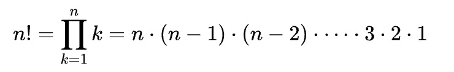
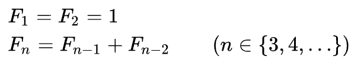

# Recursion (Factorial, Fibonacci)

### [ 문제 ]

- Recursion을 활용하여 Factorial, Fibonacci 구현

### [ 조건 ]

- 인터넷 검색 없이 정의을 보고 구현해 보기!!
- switch - case 문법 사용
    - Factorial : return 2개 사용
    - Fibonacci : return 3개 사용

### [ 예시 ]

**Factorial**

| 입력 | -> | 출력  |
|----|----|-----|
| 0  |    | 1   |
| 5  |    | 120 |

 

**Fibonacci**

| 입력 | -> | 출력 |
|----|----|----|
| 0  |    | 0  |
| 10 |    | 55 |